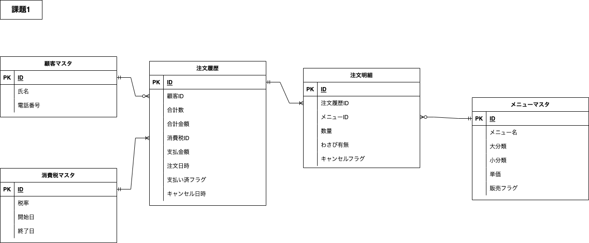
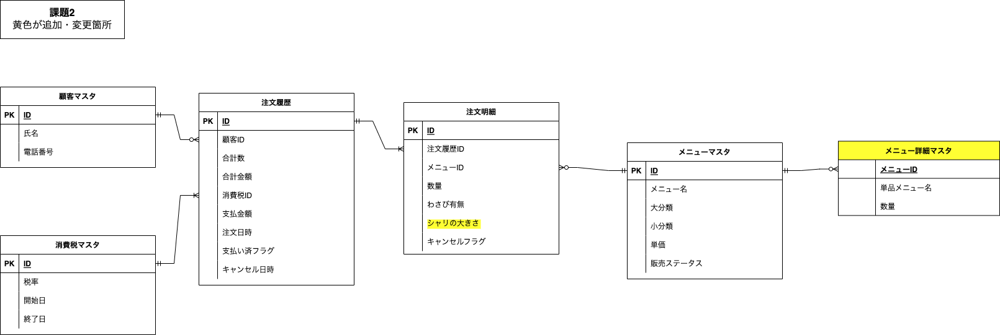
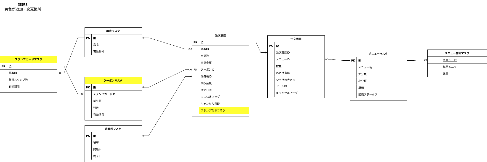
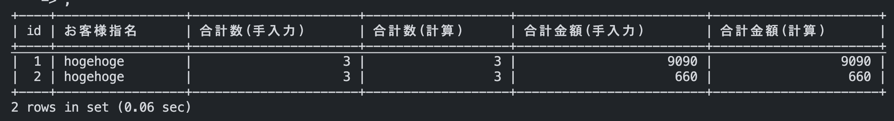
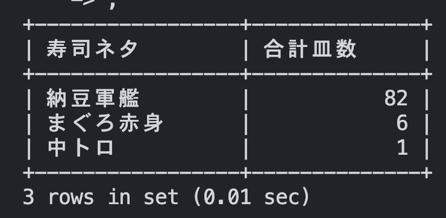

# 課題 1



# 課題 2



## ポイント

**寿司ネタごとの売り上げを集計可能** にするために、「メニュー詳細マスタ」を追加。

- セットメニューの場合  
  → 単品メニュー(ネタ)の内訳とその個数
- 単品メニュー(お好み)の場合  
  → 単品メニュー(ネタ)と個数(常に 1)

# 課題 3



## 追加仕様

スタンプカード制

- 1000 円以上で 1 個スタンプ
- 10 個おきに割引クーポン獲得
- クーポンは、獲得した段階で複数枚付与
- スタンプカード・クーポン共に有効期限あり

## ポイント

- スタンプ付与対象の注文がわかる様、スタンプ付与フラグを追加
- スタンプ付与が発生したタイミングで、「スタンプカードマスタ」を更新
- クーポンは、1 つ 1 レコードではなく残数を更新していく形で

# 課題 4

## 課題 1 検証

手入力と集計の照合


<details><summary>SQL</summary>

```
-- 注文テーブル
CREATE TABLE orders (
  id INT NOT NULL PRIMARY KEY AUTO_INCREMENT
  ,customer_id INT
  ,total_count INT
  ,total_amount INT
  ,tax_id INT
  ,payment INT
  ,finish_payment_flag INT
);

INSERT INTO orders values
(1, 1, 3, 9090, 1, 9999, 1)
,(2, 1, 3,660, 1, 726, 2)
;

/* ==============================================*/

-- 注文詳細テーブル
CREATE TABLE order_details (
  id INT NOT NULL PRIMARY KEY AUTO_INCREMENT
  ,order_id INT
  ,menu_id INT
  ,count_dishes INT
);

INSERT INTO order_details values
(1, 1, 6, 1)
,(2, 1, 1, 2)
,(3, 2, 3, 2)
,(4, 2, 5, 1)
;


/* ==============================================*/

-- 顧客マスタ
CREATE TABLE customer (
  id INT NOT NULL PRIMARY KEY AUTO_INCREMENT
  ,name VARCHAR(16)
  ,phone_number VARCHAR(13)
);

INSERT INTO customer value
(1, 'hogehoge', 'xxx-xxxx-xxxx')
;


/* ==============================================*/

-- 税率マスタ
CREATE TABLE tax (
  id INT NOT NULL PRIMARY KEY AUTO_INCREMENT
  ,rate FLOAT
  ,start_date_jst DATE
  ,end_date_jst DATE
);

INSERT INTO tax value
(1, 0.1, null, null);


/* ==============================================*/

--メニューマスタ
CREATE TABLE menu (
  id INT NOT NULL PRIMARY KEY AUTO_INCREMENT
  ,name VARCHAR(256)
  ,major_div VARCHAR(256)
  ,miner_div VARCHAR(256)
  ,cost INT
);


INSERT INTO menu values
(1, 'まぐろ赤身', 'お好み寿司', '220円（税別）', 220)
,(2, '玉子', 'お好み寿司', '100円（税別）', 100)
,(3, '納豆軍艦', 'お好み寿司', '100円（税別）',100)
,(4, 'ゆでげそ', 'お好み寿司', '150円（税別）',150)
,(5, '中トロ', 'お好み寿司', '460円（税別）',460)
,(6, 'はな', 'セットメニュー', '盛り込み', 8650)
;


/* ==============================================*/

-- 課題1 検証
WITH tmp AS (
  SELECT
    orders.id
    ,customer.name
    ,orders.total_count
    ,orders.total_amount
  FROM orders
  INNER JOIN customer
  ON orders.customer_id = customer.id
  INNER JOIN tax
  ON orders.tax_id = tax.id
)
SELECT
  tmp.id
  ,tmp.name AS 'お客様指名'
  ,tmp.total_count AS '合計数(手入力)'
  ,SUM(count_dishes) AS '合計数(計算)'
  ,tmp.total_amount AS '合計金額(手入力)'
  ,SUM(menu.cost * count_dishes) AS '合計金額(計算)'
FROM order_details od
INNER JOIN menu
ON od.menu_id = menu.id
INNER JOIN tmp
ON od.order_id = tmp.id
GROUP BY tmp.id
;
```

</details>
<br>

## 課題 2 検証

寿司ネタごとの売り上げ


<details><summary>SQL</summary>

```
-- 注文テーブル
CREATE TABLE orders (
  id INT NOT NULL PRIMARY KEY AUTO_INCREMENT
  ,customer_id INT
  ,total_count INT
  ,total_amount INT
  ,tax_id INT
  ,payment INT
  ,finish_payment_flag INT
);

INSERT INTO orders values
(1, 1, 3, 9090, 1, 9999, 1)
,(2, 1, 3,660, 1, 726, 2)
;

/* ==============================================*/

-- 注文詳細テーブル
CREATE TABLE order_details (
  id INT NOT NULL PRIMARY KEY AUTO_INCREMENT
  ,order_id INT
  ,menu_id INT
  ,count_dishes INT
);

INSERT INTO order_details values
(1, 1, 6, 1)
,(2, 1, 1, 2)
,(3, 2, 3, 2)
,(4, 2, 5, 1)
;


/* ==============================================*/

-- 顧客マスタ
CREATE TABLE customer (
  id INT NOT NULL PRIMARY KEY AUTO_INCREMENT
  ,name VARCHAR(16)
  ,phone_number VARCHAR(13)
);

INSERT INTO customer value
(1, 'hogehoge', 'xxx-xxxx-xxxx')
;


/* ==============================================*/

-- 税率マスタ
CREATE TABLE tax (
  id INT NOT NULL PRIMARY KEY AUTO_INCREMENT
  ,rate FLOAT
  ,start_date_jst DATE
  ,end_date_jst DATE
);

INSERT INTO tax value
(1, 0.1, null, null);


/* ==============================================*/

--メニューマスタ
CREATE TABLE menu (
  id INT NOT NULL PRIMARY KEY AUTO_INCREMENT
  ,name VARCHAR(256)
  ,major_div VARCHAR(256)
  ,miner_div VARCHAR(256)
  ,cost INT
);


INSERT INTO menu values
(1, 'まぐろ赤身', 'お好み寿司', '220円（税別）', 220)
,(2, '玉子', 'お好み寿司', '100円（税別）', 100)
,(3, '納豆軍艦', 'お好み寿司', '100円（税別）',100)
,(4, 'ゆでげそ', 'お好み寿司', '150円（税別）',150)
,(5, '中トロ', 'お好み寿司', '460円（税別）',460)
,(6, 'はな', 'セットメニュー', '盛り込み', 8650)
;

/* ==============================================*/

--セットメニュー詳細マスタ
CREATE TABLE menu_detail (
  menu_id INT NOT NULL
  ,single_menu_name VARCHAR(256)
  ,count INT
);


INSERT INTO menu_detail values
(1, 'まぐろ赤身', 1)
,(2, '玉子', 1)
,(3, '納豆軍艦', 1)
,(4, 'ゆでげそ', 1)
,(5, '中トロ', 1)
,(6, '納豆軍艦', 80)
,(6, 'まぐろ赤身', 4)
;


/* ==============================================*/

-- 課題2 検証
-- 売れている寿司ネタ
WITH ods AS (
  SELECT
    od.menu_id
    ,menu.name
    ,od.count_dishes
  FROM order_details od
  INNER JOIN menu
  ON od.menu_id = menu.id
)
SELECT
  md.single_menu_name '寿司ネタ'
  ,sum(ods.count_dishes * md.count) '合計皿数'
FROM ods
LEFT JOIN menu_detail md
ON ods.menu_id = md.menu_id
GROUP BY md.single_menu_name
ORDER BY sum(ods.count_dishes * md.count) desc
;
```

</details>
